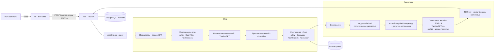

# Trend Radar — поиск слабых технологических сигналов

> Сервис находит технологии, которые только появляются, — раньше, чем о них заговорят все.
> Проект команды [НАЗВАНИЕ КОМАНДЫ] в рамках кейса Газпромбанк.Тех «Сервис для автоматизированного сбора и анализа
> зарождающихся трендов (слабые сигналы) в научно-технологических отраслях».

Пользователь вводит направление в свободной форме — «технологии в ИИ», «перспективные решения в финтехе»,
«слабые сигналы в области кибербезопасности». Сервис в реальном времени ищет свежие научные публикации, препринты
и отраслевые новости, выделяет в них технологии-кандидаты, собирает по каждой следы в открытых источниках за 12 лет
(научные работы, новости, патенты Роспатента) и оценивает интерпретируемой моделью, насколько это ещё **слабый
сигнал**, а не зрелая технология. На выходе — ТОП-15 зарождающихся технологий на русском языке с баллом уверенности,
объяснением, источниками и отчётом-инсайтом, а также список отсеянных кандидатов с причинами.

---

## Содержание

1. [Быстрый старт](#1-быстрый-старт)
2. [Что умеет сервис](#2-что-умеет-сервис)
3. [Архитектура](#3-архитектура)
4. [Пайплайн открытого запроса](#4-пайплайн-открытого-запроса)
5. [Модель: как система понимает, что это слабый сигнал](#5-модель-как-система-понимает-что-это-слабый-сигнал)
6. [Качество модели](#6-качество-модели)
7. [Качество открытого поиска](#7-качество-открытого-поиска)
8. [Источники и уровни доверия](#8-источники-и-уровни-доверия)
9. [Используемые языковые модели](#9-используемые-языковые-модели)
10. [Структура репозитория](#10-структура-репозитория)
11. [Воспроизведение результатов](#11-воспроизведение-результатов)
12. [Ограничения и известные проблемы](#12-ограничения-и-известные-проблемы)
13. [Что мы проверили и отклонили](#13-что-мы-проверили-и-отклонили)
14. [Команда](#14-команда)

---

## 1. Быстрый старт

### 1.1. Что понадобится

- Python 3.12+ (`numpy==2.5.3` на 3.11 не ставится) **или** Docker Desktop с Docker Compose;
- ключи API:
  | переменная | зачем | где получить |
  |---|---|---|
  | `YANDEX_API_KEY`, `YANDEX_FOLDER_ID` | YandexGPT: подзапросы, извлечение технологий, перевод, склейка дублей, инсайты | Yandex Cloud → сервисный аккаунт с ролью `ai.languageModels.user` |
  | `YANDEX_GPT_MODEL` | модель подзапросов и инсайтов; ставьте `yandexgpt-5-pro` — без переменной берётся `yandexgpt-lite` | — |
  | `OPENALEX_API_KEY` (или `OPEN_ALEX`) | научные публикации (счётчики и поиск) | openalex.org |
  | `ROSPATENT` | число патентов для признака `share_patent`; без ключа признак у всех кандидатов недоступен, модель подставляет медиану обучения и помечает прогон | searchplatform.rospatent.gov.ru |
  | `DATABASE_URL` (необязательно) | PostgreSQL для истории запросов; без неё история живёт в памяти процесса | — |

Скопируйте шаблон и заполните ключи:

```bash
cp .env.example .env
```

### 1.2. Запуск в Docker (рекомендуется)

```bash
docker compose up --build
```

- интерфейс: http://localhost:8501
- API: http://localhost:8000 (документация OpenAPI — http://localhost:8000/docs)

Сервисы `docker-compose.yml`: `db` (PostgreSQL 16, порт 5432), `api` (FastAPI, 8000), `ui` (Streamlit, 8501).
API при старте сам применяет схему `db/schema.sql` и заливает справочники; вручную посев запускается командой
`python -m db`. Внутри Docker интерфейс обращается к API по имени сервиса: `http://api:8000`.

Остановить: `docker compose down`.

### 1.3. Запуск без Docker

```bash
python -m venv .venv
# Windows PowerShell:
.venv\Scripts\Activate.ps1
# Linux/macOS:
source .venv/bin/activate

pip install -r requirements.txt -r api/requirements.txt -r ui/requirements.txt
```

Окно 1 — API:

```bash
python -m uvicorn api.main:app --host 127.0.0.1 --port 8000
```

Окно 2 — интерфейс:

```bash
# Windows PowerShell
$env:API_URL = "http://127.0.0.1:8000"
# Linux/macOS
export API_URL=http://127.0.0.1:8000

streamlit run ui/app.py
```

Откройте http://localhost:8501, введите направление и нажмите «Найти сигналы».

### 1.4. Запрос из командной строки

```bash
python -m pipeline "роботы для промышленности"
```

Флаги: `--time-budget 900` — бюджет времени в секундах; `--no-cache` — подзапросы и кандидаты без кэша;
`--fresh` — извлечение и счётчики без кэша (подзапросы, поиск и перевод — из кэша); `--no-rospatent` — без
Роспатента; `--no-dedup` — без склейки дублей; `--out <файл>` — куда записать JSON; `--quiet` — без строки прогресса.
Полный ответ пишется в `data/interim/pipeline_runs/<query_id>.json`, в консоль — итоговая строка.

### 1.5. Запрос через API

```bash
curl -X POST http://localhost:8000/queries \
     -H "Content-Type: application/json" \
     -d '{"topic": "перспективные решения в финтехе"}'
# → {"query_id": "..."}

curl http://localhost:8000/queries/<query_id>
# → status, progress_stage, progress_done (0–100), eta_s; по готовности — полный ответ пайплайна

curl http://localhost:8000/queries/<query_id>/insights/<rank>
# → описание, преимущества, кейсы и источники карточки
```

Тело запроса — одно поле `topic`. Формат полного ответа — как в `examples/*.json`; `GET /queries` отдаёт историю.

### 1.6. Сколько это длится

Живой запрос без кэша — **5–15 минут**: дольше всего собираются счётчики arXiv (ограничение частоты их API —
около одного запроса в 3 секунды). Бюджет времени по умолчанию — 900 с: если источники медленные, сервис
остановится вовремя и отдаст то, что успел оценить, с пометкой «не хватило времени на проверку». Повторный запрос
по той же теме идёт из кэша за 1–2 минуты. Последний этап — описания для ТОП-15 (YandexGPT, до 10 параллельно) —
добавляет около 20 секунд. В интерфейсе показывается прогресс в процентах и оценка оставшегося времени.

---

## 2. Что умеет сервис

Соответствие требованиям ТЗ:

| требование ТЗ | как реализовано |
|---|---|
| Открытый запрос в свободной форме | поле ввода в UI, `POST /queries`, CLI `python -m pipeline "<тема>"` |
| Поиск в реальном времени по открытым источникам, без привязки к датасету | arXiv, OpenAlex, TechCrunch — за последние 180 дней; кандидаты извлекаются из найденных документов, датасет используется только для обучения модели |
| ТОП-15 зарождающихся трендов | модель `s2a2-v1` оценивает до 60 кандидатов, в ТОП идут прошедшие порог 0.400, по убыванию балла |
| Описание, преимущество, кейс-пример, источники | описание под названием в ТОП и карточка технологии с отчётом-инсайтом (генерация YandexGPT **только по найденным документам**; резюме источников помечены «сгенерировано» или «перевод / сгенерировано») |
| Скоринг / уверенность модели | балл у каждой позиции и полоса уверенности; порог и плашка «> 0.75» — по вероятности модели |
| Ключевые предикторы, объяснение отнесения к слабому сигналу | вклад каждого из 6 признаков в ответе, объяснение `explanation_ru` и абзац «Почему это слабый сигнал» в карточке |
| Причины исключения зрелых и нерелевантных кандидатов | раздел «Исключённые» с причиной: «Термин давно известен в науке», «Высокая доля патентов относительно научных работ», «Пик внимания позади», «Нет следа в научных источниках…», «Дубль…», «Не хватило времени на проверку» и др. (`pipeline/reasons.py`) |
| Для источника: название, ссылка, дата, тип, язык, доверие | у каждого документа в карточке; см. [раздел 8](#8-источники-и-уровни-доверия) |
| Русский язык выдачи, пометка автоперевода | названия технологий переводятся YandexGPT с проверками; оригинальный английский термин показывается рядом; резюме зарубежных источников помечены «перевод / сгенерировано» |
| Блоги/пресс-релизы — не единственное основание | если все источники кандидата — блог или пресс-релиз, он уходит из ТОП в исключённые с причиной «Единственные источники — блог или пресс-релиз…» (`pipeline/weak_sources.py`) |
| Будет плюсом: число кандидатов со ссылкой на список | плашка «Найдено кандидатов» и кнопка «Перейти к списку кандидатов» |
| Будет плюсом: число обработанных источников | плашка «Обработано документов»: свежие документы поиска плюс публикации и патенты, по которым посчитаны признаки |
| Будет плюсом: число сигналов с уверенностью > 75% | плашка «Сигналов > 0.75 среди оценённых» |
| Docker, README, зависимости | `docker-compose.yml`, `api/Dockerfile`, `ui/Dockerfile`, `requirements.txt`, `api/requirements.txt`, `ui/requirements.txt` |
| Интерпретируемость модели | логистическая регрессия на 6 признаках с понятным смыслом и знаком веса, см. [раздел 5](#5-модель-как-система-понимает-что-это-слабый-сигнал) |

---

## 3. Архитектура

Три слоя с чётким разделением: **сбор данных** (`collector/`, `search/`), **аналитика и модель** (`pipeline/`,
`model/`), **интерфейс** (`api/` — FastAPI, `ui/` — Streamlit).



---

## 4. Пайплайн открытого запроса

Реализация — `pipeline/run_query.py`. Каждый этап пишет своё время в `timings`, счётчики — в `stats`,
проблемы — в `warnings`.

| # | этап | что делает | детали |
|---|---|---|---|
| 1 | **Подзапросы** | YandexGPT разбивает тему на узкие направления | 8 английских + 5 русских; промпт `subq-v4` (победитель турнира 11 промптов, см. §7); температура 0; кэш по теме |
| 2 | **Поиск документов** | по каждому подзапросу — свежие документы | arXiv, OpenAlex, TechCrunch; последние 180 дней; до 25 документов на подзапрос и источник; дубли по URL удаляются |
| 3 | **Отбор документов для извлечения** | формирует пачку для шага 4 | приоритет arXiv → TechCrunch → OpenAlex (OpenAlex не больше половины); если документов меньше 200 — добор из OpenAlex до 200 |
| 4 | **Извлечение технологий** | YandexGPT находит в документах классы технологий | промпт `extract-v4` знает тему запроса: общую технологию называет вместе с задачей темы («clinical AI agents»), а не общим словом; без связи с темой — не включает; дословная цитата из документа обязательна |
| 4a | **Добор** (для бедных тем) | если названных кандидатов < 60 | один дополнительный раунд подзапросов, не повторяющих первые (решение команды, см. §12) |
| 5 | **Проверка названий** | отсекает выдуманные и слишком редкие формулировки | поиск точной фразы в OpenAlex; без следа — «нет следа в публикациях» |
| 6 | **Счётчики** | собирает следы за 12 лет | OpenAlex и arXiv по годовым окнам, новости TechCrunch, патенты Роспатента; параллельные очереди по источникам, повторы при сбоях, кэш; не больше 60 кандидатов и в пределах бюджета времени |
| 7 | **Оценка моделью** | 6 признаков → вероятность слабого сигнала | модель `s2a2-v1`, порог 0.400; вклад каждого признака сохраняется |
| 8 | **Правило слабых источников** | блоги и пресс-релизы не могут быть единственным основанием | все источники кандидата — блог или пресс-релиз → из ТОП в исключённые, ранги пересчитываются |
| 9 | **Склейка дублей** | разные формулировки одной технологии — одна строка | равные ключи слов или решение YandexGPT; склеенные формулировки видны под основной («также: …») |
| 10 | **Перевод названий** | русское название класса технологий | YandexGPT + проверки кодом: кириллица, ≤ 8 слов, без отказов модели, без выдуманных аббревиатур и смешения алфавитов; при неудаче — повтор, затем запасной перевод |
| 11 | **Догрузка источников** | до 5 документов в карточку, остальное — в инсайт | OpenAlex, arXiv, TechCrunch параллельно, в пределах бюджета |
| 12 | **Описания и инсайты** | описание, преимущества, кейсы по каждой позиции ТОП-15 | YandexGPT, до 10 параллельно; без ответа модели — выдержки из документов |
| 13 | **Ответ** | ТОП-15, исключённые с причинами, статистика | формат ответа — как в `examples/*.json` |

**Инсайт** (отчёт по технологии) строится до выдачи результата: YandexGPT пишет описание, преимущества и
кейс-примеры **только по найденным документам** (`pipeline/insights.py`), со ссылками на них и пометкой о генерации.
Описание показывается под названием в ТОП, полный отчёт открывается кнопкой «Смотреть» без ожидания.

**Отказоустойчивость:** повторы при 403/429/5xx и таймаутах источников (паузы 5, 15, 45 с, не более 300 с на
источник за прогон); жёсткий дедлайн очередей; сбой одного источника не останавливает прогон, а попадает в
`warnings`; контроль квоты OpenAlex до начала счётчиков.

---

## 5. Модель: как система понимает, что это слабый сигнал

### 5.1. Идея

Слабый сигнал — это технология, о которой **уже заговорили, но ещё мало и недавно**:

- публикаций немного, но почти все — последних лет, и их число растёт;
- о ней уже пишут отраслевые медиа (рынок заметил), а не только учёные;
- её ещё почти не патентуют (массовая коммерциализация не началась);
- термин молодой — первая научная работа появилась недавно.

Зрелая технология выглядит наоборот: большой «хвост» публикаций до 2020 года, давний первый препринт, много
патентов. Всё это измеряется по открытым источникам, без знаний языковой модели.

### 5.2. Признаки и их вклад

Модель `s2a2-v1` — логистическая регрессия (scikit-learn, `class_weight="balanced"`, C = 1) на 6 признаках.
Веса стандартизованы: знак показывает направление, модуль — силу влияния.

| признак | что измеряет | вес | как читать | причина отсева на экране |
|---|---|---|---|---|
| `share_news_wordmatch` | доля отраслевых новостей среди всех упоминаний | **+1.33** | рынок заметил технологию → ближе к сигналу | «Слабый интерес рынка» |
| `recency` | доля упоминаний в последних годах | **+1.05** | интерес свежий → ближе к сигналу | «Пик внимания позади» |
| `share_patent` | доля патентов (Роспатент) среди патентов и научных работ | **−0.66** | активно патентуется → зрелая | «Высокая доля патентов относительно научных работ» |
| `age_first_arxiv` | лет с первого препринта arXiv | **−0.42** | давно в науке → зрелая | «Термин давно известен в науке» |
| `share_prev6` | доля публикаций до 2020 года | −0.10 | длинная история → зрелая | «Технология не новая: много публикаций до 2020 года» |
| `growth_research` | рост числа научных публикаций | +0.003 | почти не влияет | «Научный интерес не растёт» |

Свободный член +0.38. Порог отнесения к слабому сигналу — **0.400** (подобран на обучающей части по accuracy).

Для каждого кандидата сохраняется вклад каждого признака (вес × стандартизованное значение), и интерфейс
показывает, какие признаки подтолкнули к «сигналу», а какие — к «зрелой технологии».

**Нормировка.** При обучении признаки стандартизуются внутри каждой из шести областей обучающей выборки. Открытый
запрос области не задаёт, поэтому кандидат стандартизуется по общей статистике всех 160 технологий («режим сервиса»).
Проверено: на тех же фолдах разница AUC между режимами −0.002 ± 0.011 (10 повторов), то есть отказ от области
не ухудшает качество.

### 5.3. Почему такие признаки

Проверено больше 20 гипотез о признаках (объём упоминаний, рост в разных окнах, русскоязычные источники —
КиберЛенинка, доля русских публикаций, возраст по OpenAlex и др.). Каждая принималась, только если улучшала
качество на незнакомой области по правилу, заданному до замера. Из новых прошёл один признак —
**доля патентов Роспатента** (`share_patent`): версия `s2a1-v1` → `s2a2-v1`. `s2a1-v1` сохранена для
воспроизводимости.

### 5.4. Данные для обучения

Обучающая выборка — 160 технологий в шести областях:

- **100 слабых сигналов** — датасет организаторов (в нём только положительный класс);
- **60 не-сигналов** — собраны командой (`labels/negatives.csv`): по 10 на область, критерии «зрелая», «хайп»,
  «затухающая» зафиксированы до отбора, у каждой строки ссылка-подтверждение, половина — трудные пары к сигналам
  организаторов. Так обучают классификатор, когда размечен только положительный класс (PU-learning).

Из датасета берутся только название, область и метка; экспертные колонки признаками не служат. Для каждой технологии
собраны счётчики по тем же источникам и окнам, что и в открытом режиме, одной и той же функцией признаков. Снимок счётчиков Роспатента зафиксирован
в `evidence/rospatent_training_counts.json`, чтобы обучение воспроизводилось без сети.

---

## 6. Качество модели

### 6.1. Протокол

- **Кросс-валидация (CV):** StratifiedGroupKFold, 5 фолдов × 10 повторов; почти одинаковые технологии всегда
  попадают в один фолд (иначе метрика завышается).
- **Незнакомая область (LOAO):** модель обучается без целой области и проверяется на ней — ближе всего к открытому
  запросу по новой теме.
- Порог подбирается **только на обучающей части** каждого фолда.
- Отдельно — на 149 строках: без 11 технологий, у которых английское название выбиралось не вслепую.

### 6.2. Результаты, 160 технологий

| режим | AUC | Precision | Recall | F1 | Accuracy |
|---|---|---|---|---|---|
| CV, по области | 0.828 ± 0.007 | 0.776 ± 0.021 | 0.843 ± 0.036 | 0.808 ± 0.019 | 0.749 ± 0.023 |
| CV, режим сервиса | 0.826 ± 0.011 | 0.771 ± 0.022 | 0.843 ± 0.023 | 0.805 ± 0.014 | 0.745 ± 0.020 |
| **LOAO (незнакомая область)** | **0.837** | **0.832** | **0.783** | **0.797** | **0.757** |

### 6.3. Результаты, 149 технологий

| режим | AUC | Precision | Recall | F1 | Accuracy |
|---|---|---|---|---|---|
| CV, по области | 0.812 ± 0.016 | 0.763 ± 0.014 | 0.820 ± 0.033 | 0.790 ± 0.018 | 0.731 ± 0.019 |
| CV, режим сервиса | 0.818 ± 0.014 | 0.767 ± 0.017 | 0.814 ± 0.042 | 0.790 ± 0.025 | 0.733 ± 0.028 |
| LOAO | 0.812 | 0.796 | 0.798 | 0.786 | 0.740 |

Требование ТЗ (Precision, Recall, F1 не ниже 75–80%) выполнено во всех режимах. Для сравнения: ответ «всё —
сигнал» даёт Accuracy 0.625 и Precision 0.625.

### 6.4. Воспроизводимость

```bash
python -m scripts.verify_reproduction
```

Гейт заново обучает обе версии модели и сверяет с эталоном признаки (допуск 1e-9), веса (1e-12) и метрики (0.001);
выводит «ГЕЙТ ЗЕЛЁНЫЙ». Нужны файлы, которые по правилам проекта в git не входят: таблица признаков
`data/experiments/axis_features_*.csv` и кэш счётчиков `data/interim/collector/cache/counters/`. В репозитории лежат
список 160 технологий `data/interim/technologies.csv`, разметка `labels/` и зафиксированные снимки
`evidence/source_totals_training.json` и `evidence/rospatent_training_counts.json`.

---

## 7. Качество открытого поиска

Открытый режим проверялся **слепой разметкой**: эксперт размечал выдачу (сигнал / спорно / шум / зрелое /
зонтичный термин / по теме или нет), не зная, какой вариант системы её дал. Правило успеха задавалось **до**
запуска.

**Модель отличает сигнал от зрелого и в открытом режиме.** Сигналы и зрелые технологии организаторов подмешивали
в реальные пулы кандидатов 9 запросов (7 тем) и оценивали моделью, не видевшей их области:

| | сигналы организаторов | зрелые технологии организаторов |
|---|---|---|
| попали в ТОП-15 | **34%** (52 из 152) | **2%** (2 из 90) |
| медианный ранг | 25 | 60 |

Воспроизведение: `python -m scripts.e_mix` (входные данные — `evidence/e1_inputs/pools.json`).

**Извлечение, знающее тему, сделало выдачу предметной.** Шаг 4 раньше срезал отрасль у терминов
(статья про ИИ-агентов для приёмного отделения давала просто «AI agents»). После передачи темы в промпт на слепой
разметке трёх тем:

| | до | после |
|---|---|---|
| позиций ТОП-15 по теме | 53% | **71%** |
| разных понятий «сигнал/спорно» по теме | 8 | **14** |

Подробности: `evidence/extract_choice.md`.

**Промпт подзапросов** выбран турниром 11 вариантов на 7 темах (433 подзапроса, слепая разметка):
`evidence/subqueries_choice.md`.

**Готовые прогоны** для просмотра без запуска лежат в `examples/` — полные ответы пайплайна по темам из ТЗ
(ИИ, финтех, кибербезопасность, роботы для промышленности).

---

## 8. Источники и уровни доверия

| источник | тип | язык | как используется | доверие |
|---|---|---|---|---|
| arXiv | препринты | en | поиск кандидатов, счётчики, возраст термина | среднее |
| OpenAlex | научные публикации (журналы, конференции) | en/ru | поиск кандидатов, счётчики, проверка названий | высокое |
| TechCrunch | отраслевые медиа | en | поиск кандидатов, доля новостей (интерес рынка) | среднее |
| Роспатент | патенты (17 баз, включая РФ, ЕАПО, ВОИС, США и др.) | ru/en | только счётчик для признака зрелости `share_patent` | высокое |

Для каждого документа в карточке показываются: наименование, ссылка, дата публикации, тип источника, язык
оригинала и уровень доверия. Уровень задаётся типом документа (`collector/adapters/base.py`): высокий — статья,
патент, стандарт; средний — препринт, отчёт, новость, продукт; низкий — остальное, в том числе блоги и
пресс-релизы. Такие источники не могут быть единственным основанием для попадания в ТОП (`pipeline/weak_sources.py`).

Для зарубежных материалов показывается оригинальное название, ссылка, дата и язык; русское название технологии и
резюме в инсайте помечены как автоматический перевод/генерация.

---

## 9. Используемые языковые модели

Все вызовы — через API Yandex Cloud (разрешено ТЗ). Итоговая выдача **не** формируется знаниями языковой модели:
модель только извлекает технологии из найденных документов (с дословной цитатой), переводит и резюмирует;
отнесение к слабому сигналу делает модель `s2a2-v1` по счётчикам открытых источников.

| задача | модель | температура | где в коде |
|---|---|---|---|
| подзапросы | из `YANDEX_GPT_MODEL` (мы используем `yandexgpt-5-pro`; без переменной — `yandexgpt-lite`) | 0 (повтор 0.8) | `search/subqueries.py` |
| извлечение технологий | YandexGPT 5 Pro (`yandexgpt-5-pro`) | 0.2 (повторы 0.3 и 0.8) | `search/extract_terms.py` |
| перевод названий | YandexGPT 5 Pro | 0, затем 0.3 и 0.6 | `pipeline/translate.py` |
| склейка дублей | YandexGPT 5 Pro | 0 | `pipeline/dedup.py` |
| описания и инсайты | из `YANDEX_GPT_MODEL` (мы используем `yandexgpt-5-pro`) | 0.2 | `pipeline/insights.py` |

Подзапросы, кандидаты, перевод и склейка кэшируются; модель и версия промпта входят в ключ кэша. Каждый вызов
с расходом токенов пишется в журнал `logs/llm_calls.jsonl`.

---

## 10. Структура репозитория

```
api/            FastAPI: запуск прогона в фоне, статус и прогресс, инсайты, история (PostgreSQL или память)
ui/             Streamlit: ввод запроса, ТОП-15, карточки, исключённые, статистика; view.py — логика экрана
pipeline/       сквозной сценарий открытого запроса (run_query), прогресс, перевод, склейка, догрузка, инсайты
search/         подзапросы и извлечение технологий (промпты — search/prompts/)
collector/      клиенты источников: arXiv, OpenAlex, TechCrunch, Роспатент; повторы, кэш
model/          признаки, обучение, конфигурация версий (s2a1-v1, s2a2-v1), предсказание и объяснение
training/       загрузка датасета организаторов в чистую таблицу
db/             схема PostgreSQL (schema.sql), посев справочников, загрузка датасета и разметки
scripts/        гейт воспроизводимости, пересборка примеров, e_mix и др.
evidence/       отчёты экспериментов, зафиксированные снимки счётчиков и входные данные для цифр README
examples/       готовые полные ответы пайплайна по темам из ТЗ
labels/         наша разметка: 60 не-сигналов, группы дублей, слепая разметка выдачи
docs/           методология, описание пайплайна, интерфейс модели
tests/          608 тестов (pytest): пайплайн, модель, API, UI (Streamlit AppTest)
```

Тесты:

```bash
python -m pytest tests -q
```

Тесты, которым нужны данные обучения из `data/`, в чистой копии пропускаются с понятной причиной.

---

## 11. Воспроизведение результатов

| что | команда | данные |
|---|---|---|
| метрики модели и веса | `python -m scripts.verify_reproduction` | `data/` + `evidence/rospatent_training_counts.json` |
| обучение модели | `python -m model.train` (по умолчанию `s2a2-v1`; `--version s2a1-v1` — прошлая версия) | то же |
| 34% / 2% (подмешивание эталона) | `python -m scripts.e_mix` | `evidence/e1_inputs/pools.json` |
| пересборка готовых примеров | `python -m scripts.build_examples` | сеть, ключи |

---

## 12. Ограничения и известные проблемы

Честно о том, что работает не идеально:

- **Узкое место — поиск кандидатов, а не модель.** Когда сигнал есть среди кандидатов, модель поднимает его в
  ТОП; но поиск находит в пуле лишь часть сигналов организаторов (около 12% на четырёх темах жюри).
  Языковая модель предлагает в основном устоявшиеся направления темы, редкие новые классы технологий — реже.
- **Шум в ТОП-15.** Часть позиций — узкие формулировки из одной статьи или общие «ИИ в X» на очень широких темах
  (например, «ИИ аналитика»). Модель обучена отличать сигналы от зрелых технологий, но не от формулировок одной
  работы: у тех и других мало публикаций. Нижний порог числа публикаций проверен и отклонён — сигналы организаторов
  сами «тонкие» (§13).
- **Мало данных — одинаковые вероятности.** У технологий с 1–2 публикациями признаки упираются в крайние значения,
  и модель даёт им одинаковую вероятность. Порядок внутри таких групп задаёт балл ранжирования: при равной до
  трёх знаков вероятности выше тот, у кого больше публикаций и патентов (`docs/methodology.md`, п. 9.9).
- **Добор подзапросов (для бедных тем)** может приносить позиции с периферии темы. Включён решением команды:
  полнота выдачи в узких темах важнее.
- **Склейка дублей** ошибается примерно в 16% пар (склеивает узкий термин с широким); включена решением команды,
  склеенные формулировки не теряются: они в поле `variants` ответа и в разделе «Исключённые» с причиной «Дубль».
  `evidence/dedup_check.md`.
- **Время.** Живой запрос без кэша — до 15 минут из-за ограничений частоты arXiv.
- **Квоты.** Один запрос без кэша тратит сотни–тысячи кредитов OpenAlex.
- **Недетерминизм.** YandexGPT даже при температуре 0 иногда отвечает по-разному; повторный запрос по той же
  теме воспроизводит результат через кэш.
- **Русскоязычные источники** в поиске кандидатов используются ограниченно: проверка русскоязычного признака
  не дала прироста качества; патенты Роспатента используются как признак зрелости.

---

## 13. Что мы проверили и отклонили

Каждая идея проверялась по правилу, заданному до запуска, на слепой разметке. Отклонённое в код не вошло.
Отклонённые признаки с числами — `docs/methodology.md`, п. 7.1.

| идея | почему отклонена |
|---|---|
| Признаки из русскоязычных источников (КиберЛенинка, доля ru) | нет прироста на незнакомой области |
| Фильтры шума по правилам (Ф1–Ф4) | отсекали сигналы вместе с шумом |
| Генераторы кандидатов из «всплесков» публикаций и новостей о раундах финансирования | не увеличили число сигналов в ТОП |
| Проверка релевантности теме через LLM (2 раза, 8 промптов) | строгие промпты режут узкие сигналы, мягкие — ничего не отсекают |
| Нижний порог числа публикаций | сигналы организаторов сами «тонкие»: порог режет их вместе с шумом |
| Склейка дублей по словам (вложение ключей) | 45% ошибочных склеек |
| Добор подзапросов только из arXiv и TechCrunch | почти не добавляет кандидатов |
| Добор ТОП до 15 кандидатами ниже порога | это зрелые технологии — противоречит смыслу выдачи |

---

## 14. Команда

| участник | роль | что сделал | контакты |
|---|---|---|---|
| Ярослав | руководитель проекта, данные, скоринговая модель, работа с LLM | архитектура решения и координация; подготовка данных и признаков с проверкой на смещения выборки; логистическая регрессия: валидация, подбор порога с приоритетом precision, интерпретируемость; оценка кандидатов открытого поиска и отсечение зрелых технологий и хайпа | [Telegram](https://t.me/Yaroslvlapshin) · [GitHub](https://github.com/LapshinYaroslav) |
| Слава | сбор данных, база и бэкенд | парсеры открытых источников; свежие документы по подтемам и счётчики публикаций по годам; итоги корпуса источников по окнам; схема PostgreSQL; FastAPI и фоновые задачи | [Telegram](https://t.me/Vyacheslav_1282) · [GitHub](https://github.com/slavachlystov) |
| Егор | интерфейс и поставка | веб-интерфейс: ТОП-15, карточки, инсайты; источники с уровнем доверия; прогресс и история запросов; ETL и дедупликация документов; отказоустойчивость сбора; Docker Compose, демо-стенд, документация | [Telegram](https://t.me/Cbeezy0) · [GitHub](https://github.com/sboevegor7-spec) |