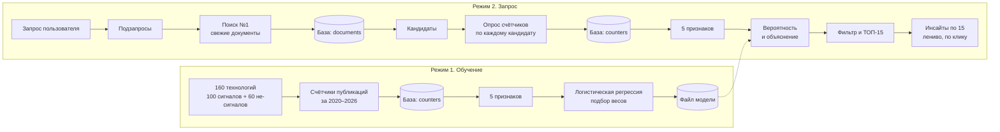

# Как работает сервис: от запроса до ТОП-15

Версия 0.2 от 20.09.2026. Подробности модели: [`methodology.md`](methodology.md).

**Что изменилось против 0.1:** признаки считаются по счётчикам публикаций, а не по выгруженным документам (раздел «Два поиска»); добавлен раздел про базу данных; контракт кандидата получил два списка терминов вместо `aliases`; фильтр мейнстрима перенесён на правила по признакам.

---

## Коротко

Сервис работает в **двух режимах**:

1. **Обучение** — один раз, заранее. Модель учится отличать слабый сигнал от зрелой технологии по «следу» в открытых источниках и запоминает веса признаков.
2. **Запрос** — каждый раз. Сервис находит технологии-кандидаты по теме пользователя, считает для каждого те же признаки и оценивает их обученной моделью.

Главная идея: **признаки в обоих режимах считает одна и та же функция** по числам из одних и тех же источников. Поэтому то, что модель выучила на обучении, работает на реальном запросе.



---

## Режим 1. Обучение

| # | Шаг | Результат | Кто |
|---|---|---|---|
| 1 | Список технологий: 100 сигналов из датасета + 60 не-сигналов из `labels/negatives.csv` | 160 названий с метками | Ярослав |
| 2 | Поисковые термины: два списка на технологию, **без названий компаний** | `terms` и `context_terms` на каждую | Ярослав |
| 3 | Опрос счётчиков по каждой технологии за 01.09.2020–31.08.2026 | числа + итоги источников, в базу | Слава |
| 4 | Функция признаков `compute_features` | таблица 160 × 5 | Ярослав |
| 5 | Логистическая регрессия, проверка на кросс-валидации с группами дубликатов | веса признаков, метрики | Ярослав |
| 6 | Сохранение модели и метаданных | `data/models/` | Ярослав |

Термины строятся одинаково для сигналов и не-сигналов, одним промптом и одним кодом. Если добавлять к запросам сигналов компании из датасета или писать термины двух классов разными способами, модель выучит разницу в способе поиска, а не в технологиях.

> **Проверка перед обучением:** распределение числа терминов по классам. Если у сигналов терминов систематически больше, чем у не-сигналов, `volume` смещён разметкой, и обучать нельзя.

---

## Режим 2. Запрос пользователя

| # | Шаг | Вход → выход | Кто |
|---|---|---|---|
| 1 | Пользователь вводит тему | «слабые сигналы в кибербезопасности» | — |
| 2 | LLM разбивает тему на подтемы | тема → 5–10 подтем с терминами | Ярослав |
| 3 | **Поиск №1**: свежие документы по подтемам | подтемы → статьи и новости | Слава |
| 4 | LLM извлекает из текстов названия технологий | документы → кандидаты + привязка к документам | Егор |
| 5 | **Опрос счётчиков** по каждому кандидату | кандидат → 5 чисел за 6 лет | Слава |
| 6 | Функция признаков | числа → 5 признаков | Ярослав |
| 7 | Модель: `score_candidate` | признаки → вероятность + вклады | Ярослав |
| 8 | Фильтр мейнстрима, порог, сортировка | кандидаты → ТОП-15 + причины отсева | Егор, Ярослав |
| 9 | Инсайт по сигналу, лениво при открытии карточки | сигнал → описание, преимущество, кейс | Егор |
| 10 | Интерфейс | всё выше → дашборд и страница инсайта | Егор |

---

## Подробно: два поиска

Их легко спутать, а это разные задачи, и с версии 0.2 они возвращают разное.

|  | Поиск №1 | Поиск №2 (опрос счётчиков) |
|---|---|---|
| Вопрос | **Что** сейчас обсуждают по теме? | **Как давно и как активно** обсуждают эту технологию? |
| Запрос | широкий, по подтемам | узкий, по терминам кандидата |
| Период | свежие документы | 01.09.2020 – 31.08.2026 |
| Возвращает | **документы** с текстом | **числа**, документов нет |
| Результат | кандидаты | признаки |

**Признаки считаются только по поиску №2.** Если считать рост по поиску №1, все кандидаты окажутся «свежими»: мы специально искали свежее.

### Почему счётчики, а не документы

Любой источник отдаёт ограниченное число записей за запрос, и приходится ставить потолок. Потолок вместе с сортировкой портит признаки, причём тем сильнее, чем больше публикаций у технологии, то есть смещение коррелирует с меткой:

- сортировка по дате → остаются самые свежие, `recency` уезжает к 1, `growth` завышается;
- сортировка по релевантности → остаются старые цитируемые работы, свежие пропадают, `growth` занижается.

Оба варианта проверены на прогоне: при потолке 200 и сортировке по релевантности у технологии с сотнями работ в 2026 году из OpenAlex не осталось ни одного документа при 23 на arXiv.

Счётчики этой проблемы не имеют: источник отвечает, сколько всего записей подходит под фильтр, независимо от того, сколько из них можно выгрузить.

### Какие счётчики нужны

На одного кандидата пять чисел плюс разбивка:

| Счётчик | Период | Для чего |
|---|---|---|
| всего | 01.09.2020–31.08.2026 | `volume` |
| окно `now` | 01.09.2025–31.08.2026 | `growth` |
| окно `before` | 01.09.2023–31.08.2024 | `growth` |
| последние 24 месяца | 01.09.2024–31.08.2026 | `recency` |
| по источникам | весь период | `share_research`, `share_market` |

Доли типов выводятся из разбивки по источникам: у arXiv тип всегда `preprint`, у новостных источников практически всегда `news`. Отдельного счётчика по типам не требуется.

Как источники отвечают на вопрос «сколько всего»: OpenAlex — поле `meta.count`, arXiv — `totalResults` в Atom, TechCrunch — заголовок `X-WP-Total`.

> **Требование к выбору источников:** источник должен уметь отвечать «сколько всего документов подходит под фильтр за период». Источник без такой возможности в расчёт признаков не входит. Проверять до начала сбора.

### Фильтр по типу записи

Счётчик берётся **с фильтром `type:article`** — и в числителе, и в знаменателе.

Причина: в 2026 году OpenAlex провёл ретро-индексацию книг и глав, проставив им свежие даты публикации. Корпус окна `now` из-за этого раздут втрое против `before` (36,6 млн против 10,6 млн), и поправка на фон вычитает из `growth` около 1,23 у всех технологий сразу. С фильтром по типу отношение корпусов возвращается к правдоподобным 1,40.

Фильтр обязан применяться к обеим сторонам формулы. Если числитель считается по всем типам, а знаменатель только по статьям, они считаются по разным множествам, и результат бессмысленный.

---

## Подробно: что отдаёт сборщик

С версии 0.2 у сборщика два выхода: счётчики для признаков и документы для текста.

### Счётчик

```json
{"tech_key": "c42", "source": "openalex", "window": "now",
 "date_from": "2025-09-01", "date_to": "2026-09-01",
 "type_filter": "article", "query_variant": "phrase|article", "n": 39}
```

### Документ

Документы нужны поиску №1 (из них извлекаются кандидаты) и инсайтам по ТОП-15. В признаках они не участвуют.

| Поле | Пример | Для чего |
|---|---|---|
| `published_at` | `2026-03-20` | сортировка, отображение |
| `source` | `openalex` | отображение |
| `source_type` | `paper` | отображение, уровень доверия |
| `title`, `url`, `language` | — | проверка источника в интерфейсе (ТЗ) |
| `trust_level` | `high` / `medium` / `low` | уровень доверия в интерфейсе (ТЗ) |
| `organizations` | `["MIT", "Lightmatter"]` | будущие признаки про участников |
| `text` | — | инсайты |

Допустимые `source_type`: `paper`, `preprint`, `patent`, `news`, `press_release`, `product`, `report`, `standard`, `blog`. Любое другое значение — ошибка сборщика.

**Поле `text` — это аннотация или лид, до 1500 знаков, не полный текст.** OpenAlex, arXiv и патентные базы отдают аннотацию прямо в ответе API; полный текст потребовал бы отдельного запроса на документ и разбора PDF, то есть десятков тысяч запросов и парсера, который ломается на каждой второй вёрстке.

---

## Подробно: что лежит в базе

PostgreSQL — не кэш и не оптимизация, а часть архитектуры. Без неё не работают ни обучение, ни приемлемое время ответа, ни счётчик обработанных источников в интерфейсе.

| Таблица | Что хранит | Кто пишет | Кто читает |
|---|---|---|---|
| `counters` | числа по технологии, источнику и окну | сборщик | признаки |
| `source_totals` | итоги источника по окнам (знаменатель `growth`) | сборщик | признаки |
| `documents` | метаданные и аннотация | сборщик | кандидаты, инсайты, интерфейс |
| `tech_documents` | связка технология → документ | сборщик | интерфейс |
| `features` | посчитанные признаки по технологии | Ярослав | модель, кэш |
| `scores` | вероятность, вклады признаков, версия модели | Ярослав | интерфейс |
| `insights` | сгенерированный текст инсайта | Егор | интерфейс |

**Где база стоит в пайплайне.** В режиме 1 — между шагами 3 и 4: сборщик пишет счётчики, `build_feature_table()` читает их. Собрать данные по 160 технологиям — операция на часы, переживать её при каждой правке признаков нельзя. В режиме 2 — между шагами 5 и 6: опрос счётчиков сначала смотрит в `counters`, и если технология уже встречалась, сбор не выполняется. Это превращает риск скорости из «три минуты на запрос» в «три минуты на первый запрос по теме и секунды на повторный».

**Ключ технологии.** В обучении это `tech_id` из обучающей таблицы (`s9`, `n12`), в режиме запроса — кандидат (`c42`). Чтобы кэш работал между разными пользовательскими запросами, ключом служит нормализованное английское название, а `s9` / `c42` остаются идентификаторами строк, а не ключами кэша.

**Ключ строки счётчика** — пятёрка `(tech_key, terms_hash, source, period, query_variant)`.

| Поле | Зачем в ключе |
|---|---|
| `terms_hash` | отпечаток терминов. Уточнили термины — отпечаток другой — старые числа не вернутся. Фильтра типа в нём нет: это константа OpenAlex, и в общем отпечатке она сидела бы в ключе GitHub и Википедии, которым до типов записи OpenAlex дела нет |
| `period` | окно. В `terms_hash` не входит намеренно: иначе добавление одного нового окна выбрасывало бы все ранее собранные строки по всем окнам |
| `query_variant` | семантика запроса: `phrase\|article`, `and\|article`, `phrase\|all_types`, `gh:name,description,readme`. Один источник опрашивается несколькими способами, и числа разных способов несравнимы |

Запись сливает строки по паре (окно, `query_variant`), а не заменяет файл целиком: сборщик одной семантики не должен уносить числа другой. Файл кэша заведён на пару (технология, источник) — сборщики источников работают независимо, и обрыв одного не переписывает чужие строки.

**Дедупликация документов.** Один документ, найденный по двум технологиям, хранится один раз в `documents` и двумя строками в `tech_documents`. Число обработанных источников для интерфейса считается по `documents`.

---

## Подробно: пять признаков

| Признак | Что измеряет | Формула | Ожидание у сигнала |
|---|---|---|---|
| `volume` | сколько пишут | `ln(1 + n_всего)` | меньше |
| `growth` | насколько быстрее отрасли растёт доля технологии | `ln((n_now+1)/(n_before+1)) − ln(N_now/N_before)` | больше |
| `recency` | насколько тема свежая | `n_24мес / n_всего` | больше |
| `share_research` | доля научных источников | `n_research / (n_research + n_market)` | **меньше** |
| `share_market` | доля рыночных источников | `1 − share_research` | **больше** |

Как читать `growth`: `0` — растёт как отрасль; `+0,69` — доля выросла вдвое (`e^0,69 ≈ 2`); отрицательное — медленнее отрасли.

Все счётчики берутся за `01.09.2020 ≤ дата < 01.09.2026` с фильтром по типу записи. Если документов нет, `volume = 0`, остальные признаки `NaN` («нечего считать», а не «ноль»). `growth` считается только по источникам, у которых есть итоги за оба окна; иначе `NaN`.

> **Измерено на 26 технологиях области Edge 20.09.2026: знак обратный ожиданию.**
> У сигналов `share_research` НИЖЕ, у негативов выше: медианы 0.53 против 0.99 на сырых
> долях, ROC AUC 0.250. Проверено на всех трёх нормировках — сырые 0.250, на корпус
> источника 0.312, на медиану выборки 0.287, — знак везде один. Причина: зрелая
> технология копила статьи годами при умершем новостном потоке, а зарождающаяся имеет
> десяток статей и всплеск новостей о раундах; в датасете организаторов 43 сигнала
> из 100 обоснованы инвестраундом. Гипотезы ниже оставлены как были, чтобы видеть,
> что именно не подтвердилось.

> **Известное ограничение:** при трёх источниках `share_research` и `share_market` почти дополняют друг друга до единицы, то есть фактически работают как один признак. Лечится добавлением патентного источника. Если не успеваем — говорим об этом жюри сами.

---

## Подробно: как модель превращает признаки в вероятность

```
1. Стандартизация   x_ст = (x − среднее) / стандартное отклонение
2. Сумма с весами   z = b + w₁·x₁_ст + w₂·x₂_ст + … + w₅·x₅_ст
3. Вероятность      p = 1 / (1 + e^(−z))
```

- **Стандартизация** приводит признаки к одной шкале. Без неё объём, измеряемый в единицах, перевесил бы доли от 0 до 1.
- **Веса `w` и свободный член `b`** модель подбирает на обучении. Вручную их никто не назначает.
- **Сигмоида** превращает любую сумму в число от 0 до 1: `z = 0 → 0,50`, `z = 2 → 0,88`, `z = −2 → 0,12`.

**Объяснение для интерфейса** получается бесплатно: вклад признака = `w · x_ст`.

| Признак | Вес | Значение (станд.) | Вклад |
|---|---|---|---|
| `growth` | 0,8 | +2,0 | **+1,6** |
| `share_research` | 0,5 | +1,0 | **+0,5** |
| `volume` | −0,4 | +1,0 | **−0,4** |
| свободный член | | | +0,3 |
| **Итого** | | | **z = 2,0 → p = 0,88** |

*Числа условные.* В интерфейсе: «Доля публикаций выросла быстрее отрасли в 3,1 раза» — главный довод за сигнал.

---

## Подробно: фильтр мейнстрима (шаг 8)

Фильтр работает **правилами по признакам**, а не через LLM. Признаки уже посчитаны, и почти весь отсев из них выводится:

| Причина отсева | Как видно из признаков |
|---|---|
| зрелая технология | высокий `volume` при `growth` около нуля или отрицательном |
| маркетинговый хайп | высокая `share_market` при низкой `share_research` и близком к нулю `growth_research` |
| информационный шум | очень малый `volume`, признаки ненадёжны |

Правило дешевле и быстрее вызова модели, а главное — объяснимо теми же числами, что показаны в карточке. ТЗ требует показывать причину исключения, и число в причине убедительнее фразы.

LLM остаётся на спорной зоне у порога и на случаях, где числа не решают.

**Фильтр применяется после скоринга, а не до.** Иначе кандидат, срезанный по другой причине (например, по лимиту числа кандидатов), получит ложную причину отсева.

Порог подбирается после обучения с упором на Precision: зрелая технология в ТОП-15 заметна жюри, пропуск сигнала — нет.

---

## Подробно: инсайты (шаг 9)

Инсайты генерируются **лениво, при открытии карточки**, и кэшируются в `insights`.

Дашборду инсайты не нужны: там название, скоринг и ключевые предикторы, и всё это приходит от модели. Генерация пятнадцати отчётов до показа дашборда добавила бы от тридцати секунд до минуты на критический путь демо, где жюри вводит запрос вживую и ждёт.

Источник материала для инсайта: документы, найденные в поиске №1 и привязанные к кандидату, плюс небольшая догрузка по финалистам, если своих документов не хватает. Догрузка идёт после отбора ТОП-15, пока пользователь смотрит на дашборд.

Инсайт строится **по найденным документам**, а не по знаниям языковой модели — это прямое требование ТЗ.

---

## Подробно: что показывает интерфейс (требования ТЗ)

**Дашборд**
- поисковый запрос;
- ТОП-15: название, скоринг (уверенность модели), ключевые предикторы;
- причины исключения зрелых технологий и нерелевантных кандидатов;
- *плюсом:* число обработанных источников, число кандидатов со ссылкой на список, число сигналов с уверенностью выше 75%.

**Страница инсайта** (похожа на документ-отчёт)
- описание технологии, преимущества, кейс-примеры;
- объяснение статуса слабого сигнала и уверенности модели;
- источники: название, ссылка, дата, тип, язык, уровень доверия;
- для зарубежных источников русскоязычное резюме с пометкой об автоматическом переводе или генеративном резюме.

Соцсети, блоги, пресс-релизы не могут быть единственным основанием для включения технологии: нужно подтверждение независимыми источниками или отметка о пониженном доверии. Если доверие понижено по этой причине, интерфейс показывает причину, а не только уровень.

---

## Контракты между участниками

**Подтема** (Ярослав → Слава)
```json
{"subtopic": "фотонные ускорители инференса",
 "terms": ["photonic inference processor", "optical AI accelerator"],
 "context_terms": ["photonic computing", "silicon photonics"]}
```

Булев запрос собирает код из двух списков: `("t1" OR "t2") AND ("c1" OR "c2")`. Модель кавычек и операторов не пишет — она их теряет и ломает JSON.

**Кандидат** (Егор → Слава, Ярослав)
```json
{"candidate_id": "c42", "query_id": "q7",
 "name_ru": "Фотонные процессоры инференса", "name_en": "photonic inference processor",
 "terms": ["photonic inference processor", "optical AI accelerator"],
 "context_terms": ["photonic computing", "silicon photonics"],
 "doc_ids": ["d113", "d288"]}
```

Поле `aliases` из версии 0.1 заменено на два списка: термины идут в запрос напрямую, и склейка двух разных понятий через OR разносит выдачу на порядки. `doc_ids` — документы, из которых кандидат извлечён; по ним строится инсайт.

**Результат оценки** (Ярослав → Егор)
```json
{"candidate_id": "c42", "score": 0.88, "model_version": "v1", "cutoff_date": "2026-09-01",
 "features": {"volume": 4.95, "growth": 1.14, "recency": 0.71, "share_research": 0.55, "share_market": 0.20},
 "top_features": [
   {"name": "growth", "value": 1.14, "contribution": 1.6,
    "explanation_ru": "Доля публикаций выросла быстрее отрасли в 3,1 раза"}]}
```

**Отсев** (Егор)
```json
{"candidate_id": "c77", "skipped_reason": "mainstream",
 "explanation_ru": "Публикаций много, доля не растёт быстрее отрасли"}
```

Причина отсева по лимиту числа кандидатов и причина «мейнстрим» — разные значения. Смешивать их нельзя: интерфейс покажет ложное объяснение.

Контракты меняются только через pull request с согласия всех, кого они касаются.

---

## Риски

**Смещение счётчиков индексацией.** Ретро-индексация книг в OpenAlex раздула корпус окна `now` втрое. Лечится фильтром `type:article` на обе стороны формулы. Проверять годовые срезы корпуса перед каждым большим прогоном: подобное может повториться.

**Вырожденные доли.** При трёх источниках `share_research` и `share_market` почти дополняют друг друга. Варианты: добавить патентный источник или честно считать, что признаков четыре.

**Неоднозначные названия.** Короткие названия и аббревиатуры (OCS, PBM) дают посторонние документы, счётчики искажаются. Лечится блоком `context_terms` и выборочной ручной проверкой.

**Источники без итогов.** Если у источника нет общего числа документов по окнам, рост по нему не считается. Если таких источников много, признак `growth` будет часто пустым.

**Скорость ответа.** Снят переходом на счётчики: пять быстрых запросов на кандидата вместо выгрузки документов, плюс кэш в `counters` и параллельные запросы. Ограничение в 30 кандидатов оставлено как страховка.

---

## Словарь

| Термин | Значение |
|---|---|
| Кандидат | технология, извлечённая из документов по запросу; ещё не оценена моделью |
| Слабый сигнал | кандидат с вероятностью выше порога, прошедший фильтр мейнстрима |
| Счётчик | число документов, подходящих под фильтр, без их выгрузки |
| Признак | число, посчитанное по счётчикам технологии |
| Вес | число, которое модель подобрала на обучении: насколько сильно и в какую сторону признак влияет на ответ |
| Вклад | `вес × стандартизованное значение`: сколько признак добавил к ответу для конкретной технологии |
| Дата среза | 01.09.2026: документы с этой даты и позже не учитываются |
| Окно `now` / `before` | 01.09.2025–31.08.2026 / 01.09.2023–31.08.2024 |
