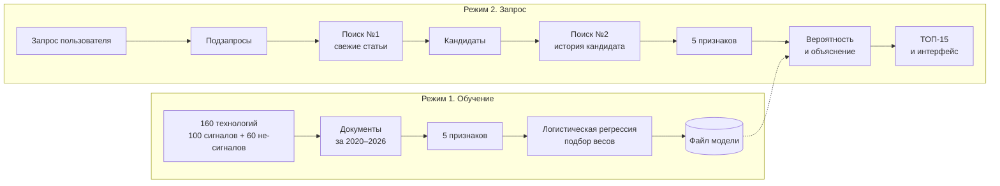

# Как работает сервис: от запроса до ТОП-15

Черновик, версия 0.1 от 17.09.2026. Подробности модели: [`methodology.md`](methodology.md).

---

## Коротко

Сервис работает в **двух режимах**:

1. **Обучение** — один раз, заранее. Модель учится отличать слабый сигнал от зрелой технологии по «следу» в открытых источниках и запоминает веса признаков.
2. **Запрос** — каждый раз. Сервис находит технологии-кандидаты по теме пользователя, считает для каждого те же признаки и оценивает их обученной моделью.

Главная идея: **признаки в обоих режимах считает одна и та же функция** из документов одних и тех же источников. Поэтому то, что модель выучила на обучении, работает на реальном запросе.



---

## Режим 1. Обучение

| # | Шаг | Результат | Кто |
|---|---|---|---|
| 1 | Список технологий: 100 сигналов из датасета + 60 не-сигналов из `labels/negatives.csv` | 160 названий с метками | Ярослав |
| 2 | Поисковые запросы: название + синонимы на английском, **без названий компаний** | запросы на каждую технологию | Даня |
| 3 | Сборщик находит документы по каждой технологии за 01.09.2020–31.08.2026 | документы + итоги источников | Слава |
| 4 | Функция признаков `compute_features` | таблица 160 × 5 | Ярослав |
| 5 | Логистическая регрессия, проверка на кросс-валидации с группами дубликатов | веса признаков, метрики | Ярослав |
| 6 | Сохранение модели и метаданных | `data/models/` | Ярослав |

Запросы строятся одинаково для сигналов и не-сигналов. Если добавлять к запросам сигналов компании из датасета, документы двух классов будут найдены разными способами, и модель выучит разницу в способе поиска, а не в технологиях.

---

## Режим 2. Запрос пользователя

| # | Шаг | Вход → выход | Кто |
|---|---|---|---|
| 1 | Пользователь вводит тему | «слабые сигналы в кибербезопасности» | — |
| 2 | LLM разбивает тему на подзапросы | тема → 5–10 подзапросов | Даня |
| 3 | **Поиск №1**: свежие документы по подзапросам | подзапросы → статьи и новости | Слава |
| 4 | LLM извлекает из текстов названия технологий | статьи → кандидаты | Даня |
| 5 | **Поиск №2**: история каждого кандидата | кандидат → документы за 6 лет | Слава |
| 6 | Функция признаков | документы → 5 чисел | Ярослав |
| 7 | Модель: `score_candidate` | 5 чисел → вероятность + вклады признаков | Ярослав |
| 8 | Фильтр мейнстрима, порог, сортировка | кандидаты → ТОП-15 + причины отсева | Даня, Ярослав |
| 9 | Инсайт по каждому сигналу **по найденным документам** | сигнал → описание, преимущество, кейс | Даня |
| 10 | Интерфейс | всё выше → дашборд и страница инсайта | Егор |

---

## Подробно: два поиска

Их легко спутать, а это разные задачи.

|  | Поиск №1 | Поиск №2 |
|---|---|---|
| Вопрос | **Что** сейчас обсуждают по теме? | **Как давно и как активно** обсуждают эту технологию? |
| Запрос | широкий, по подзапросам темы | узкий, по названию кандидата и синонимам |
| Период | свежие документы | 01.09.2020 – 31.08.2026 |
| Результат | кандидаты | признаки |

**Признаки считаются только по поиску №2.** Если считать рост по поиску №1, все кандидаты окажутся «свежими»: мы специально искали свежее.

---

## Подробно: что отдаёт сборщик

### Документ

Для пяти текущих признаков достаточно трёх полей, но сборщик отдаёт полный набор: остальные поля нужны интерфейсу по ТЗ и следующим признакам.

| Поле | Пример | Для чего |
|---|---|---|
| `published_at` | `2026-03-20` | рост, свежесть |
| `source` | `openalex` | поправка роста на фон |
| `source_type` | `paper` | доли научных и рыночных документов |
| `title`, `url`, `language` | — | проверка источника в интерфейсе (ТЗ) |
| `trust_level` | `high` / `medium` / `low` | уровень доверия в интерфейсе (ТЗ), будущие признаки |
| `organizations` | `["MIT", "Lightmatter"]` | будущие признаки про участников |
| `text` | — | инсайты, маркеры зрелости |

Допустимые `source_type`: `paper`, `preprint`, `patent`, `news`, `press_release`, `product`, `report`, `standard`, `blog`. Любое другое значение — ошибка сборщика, функция признаков падает сразу.

### Источник и итоги источника

**`source`** — конкретная база или сайт, откуда взят документ: `arxiv`, `openalex`, `techcrunch`. В тестах вместо реальных имён используются условные `s1`, `s2`.

**Итоги источника** (`source_totals`) — сколько **всего** документов было в источнике за окно, независимо от технологии:

| source | window | n_total |
|---|---|---|
| openalex | before (01.09.2023–31.08.2024) | 1 000 |
| openalex | now (01.09.2025–31.08.2026) | 1 250 |

Зачем: сами источники растут. Если по технологии статей стало вдвое больше, а вся база выросла вдвое, это фон, а не сигнал. Источник без итогов за оба окна в расчёт роста не входит, остальные признаки по нему считаются.

> **Требование к выбору источников:** для расчёта роста нужен источник, который умеет ответить «сколько всего документов было с такой-то по такую-то дату». Проверить для каждого источника до начала сбора.

---

## Подробно: пять признаков

| Признак | Что измеряет | Формула | Ожидание у сигнала |
|---|---|---|---|
| `volume` | сколько пишут | `ln(1 + число документов)` | меньше |
| `growth` | насколько быстрее отрасли растёт доля технологии | `ln((n_now+1)/(n_before+1)) − ln(N_now/N_before)` | больше |
| `recency` | насколько тема свежая | документы за 24 месяца / все документы | больше |
| `share_research` | доля научных документов | `paper + preprint + patent` / все | больше |
| `share_market` | доля рыночных документов | `news + press_release + product` / все | меньше |

Как читать `growth`: `0` — растёт как отрасль; `+0,69` — доля выросла вдвое (`e^0,69 ≈ 2`); отрицательное — медленнее отрасли.

Документы учитываются, если `01.09.2020 ≤ дата < 01.09.2026`. Документы без даты не учитываются. Если документов нет, `volume = 0`, остальные признаки `NaN` («нечего считать», а не «ноль»).

---

## Подробно: как модель превращает признаки в вероятность

```
1. Стандартизация   x_ст = (x − среднее) / стандартное отклонение
2. Сумма с весами   z = b + w₁·x₁_ст + w₂·x₂_ст + … + w₅·x₅_ст
3. Вероятность      p = 1 / (1 + e^(−z))
```

- **Стандартизация** приводит признаки к одной шкале. Без неё объём, измеряемый в единицах, перевесил бы доли от 0 до 1.
- **Веса `w` и свободный член `b`** модель подбирает на обучении. Вручную их никто не назначает.
- **Сигмоида** превращает любую сумму в число от 0 до 1: `z = 0 → 0,50`, `z = 2 → 0,88`, `z = −2 → 0,12`.

**Объяснение для интерфейса** получается бесплатно: вклад признака = `w · x_ст`.

| Признак | Вес | Значение (станд.) | Вклад |
|---|---|---|---|
| `growth` | 0,8 | +2,0 | **+1,6** |
| `share_research` | 0,5 | +1,0 | **+0,5** |
| `volume` | −0,4 | +1,0 | **−0,4** |
| свободный член | | | +0,3 |
| **Итого** | | | **z = 2,0 → p = 0,88** |

*Числа условные.* В интерфейсе: «Доля публикаций выросла быстрее отрасли в 3,1 раза» — главный довод за сигнал.

---

## Подробно: что показывает интерфейс (требования ТЗ)

**Дашборд**
- поисковый запрос;
- ТОП-15: название, скоринг (уверенность модели), ключевые предикторы;
- причины исключения зрелых технологий и нерелевантных кандидатов;
- *плюсом:* число обработанных источников, число кандидатов со ссылкой на список, число сигналов с уверенностью выше 75%.

**Страница инсайта** (похожа на документ-отчёт)
- описание технологии, преимущества, кейс-примеры;
- объяснение статуса слабого сигнала и уверенности модели;
- источники: название, ссылка, дата, тип, язык, уровень доверия;
- для зарубежных источников русскоязычное резюме с пометкой об автоматическом переводе или генеративном резюме.

Соцсети, блоги, пресс-релизы не могут быть единственным основанием для включения технологии: нужно подтверждение независимыми источниками или отметка о пониженном доверии.

---

## Контракты между участниками

**Кандидат** (Даня → Слава, Ярослав)
```json
{"candidate_id": "c42", "query_id": "q7",
 "name_ru": "Фотонные процессоры инференса", "name_en": "photonic inference processors",
 "aliases": ["optical AI accelerator", "photonic computing"]}
```

**Документы** (Слава → Ярослав; обучение — шаг 3, запрос — поиск №2)
```json
{
  "candidate_id": "c42",
  "documents": [
    {
      "published_at": "2026-03-20",
      "source": "openalex",
      "source_type": "paper",
      "title": "...",
      "url": "...",
      "language": "en",
      "trust_level": "high",
      "organizations": ["MIT", "Lightmatter"],
      "text": "..."
    }
  ],
  "source_totals": [
    {"source": "openalex", "window": "before", "n_total": 1000},
    {"source": "openalex", "window": "now", "n_total": 1250}
  ]
}
```

Поиск №1 отдаёт только свежие документы и **не** является входом в `compute_features`.

**Результат оценки** (Ярослав → Даня, Егор)
```json
{"candidate_id": "c42", "score": 0.88, "model_version": "v1", "cutoff_date": "2026-09-01",
 "features": {"volume": 4.95, "growth": 1.14, "recency": 0.71, "share_research": 0.55, "share_market": 0.20},
 "top_features": [
   {"name": "growth", "value": 1.14, "contribution": 1.6,
    "explanation_ru": "Доля публикаций выросла быстрее отрасли в 3,1 раза"}]}
```

Контракты меняются только через pull request с согласия всех, кого они касаются.

---

## Риски

**Скорость ответа.** Поиск №2 выполняется для каждого кандидата. При 40 кандидатах и 5 секундах на поиск запрос займёт больше трёх минут, а на демо жюри вводит запрос в реальном времени. Варианты:
1. ограничить число кандидатов (например, 30), отсекая очевидный мейнстрим до поиска №2;
2. выполнять поиски по кандидатам параллельно;
3. кэшировать документы и признаки в PostgreSQL: кандидат из прошлых запросов берётся из таблицы `features`.

**Источники без итогов.** Если у источника нет общего числа документов по окнам, рост по нему не считается. Если таких источников много, признак `growth` будет часто пустым.

**Неоднозначные названия.** Короткие названия и аббревиатуры (OCS, PBM) дают посторонние документы, признаки искажаются. Нужны точные синонимы и выборочная ручная проверка.

---

## Словарь

| Термин | Значение |
|---|---|
| Кандидат | технология, извлечённая из документов по запросу; ещё не оценена моделью |
| Слабый сигнал | кандидат с вероятностью выше порога, прошедший фильтр мейнстрима |
| Признак | число, посчитанное по документам технологии |
| Вес | число, которое модель подобрала на обучении: насколько сильно и в какую сторону признак влияет на ответ |
| Вклад | `вес × стандартизованное значение`: сколько признак добавил к ответу для конкретной технологии |
| Дата среза | 01.09.2026: документы с этой даты и позже не учитываются |
| Окно `now` / `before` | 01.09.2025–31.08.2026 / 01.09.2023–31.08.2024 |
