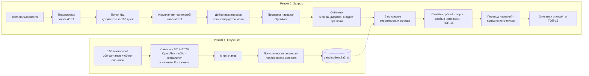

# Как работает сервис: от запроса до ТОП-15

Версия 0.3 от 29.09.2026. Подробности модели: [`methodology.md`](methodology.md), интерфейс модели:
[`model_interface.md`](model_interface.md). Код сквозного сценария — `pipeline/run_query.py`.

**Что изменилось против 0.2:** запрос идёт без области (нормировка всегда общая); кандидата ищут одним термином без
`context_terms`; добавлены добор подзапросов, проверка названий, бюджет времени, склейка дублей, перевод названий,
правило слабых источников и догрузка источников; инсайты строятся до выдачи, а не по клику; PostgreSQL стала
необязательной; фильтр мейнстрима — порог модели с причинами без чисел; контракты переписаны по реальным полям.

---

## Коротко

Сервис работает в **двух режимах**:

1. **Обучение** — один раз, заранее. Модель учится отличать слабый сигнал от зрелой технологии по «следу» в открытых источниках и запоминает веса признаков.
2. **Запрос** — каждый раз. Сервис находит технологии-кандидаты по теме пользователя, считает для каждого те же признаки и оценивает их обученной моделью.

Главная идея: **признаки в обоих режимах считает одна и та же функция** (`model/candidate.py`) по числам из одних и тех же источников, с одинаковым построением поискового запроса. Поэтому то, что модель выучила на обучении, работает на реальном запросе.


```mermaid
flowchart LR
    subgraph T["Режим 1. Обучение"]
        T1["160 технологий<br/>100 сигналов + 60 не-сигналов"] --> T2["Счётчики 2014–2026<br/>OpenAlex · arXiv · TechCrunch<br/>+ патенты Роспатента"]
        T2 --> T3["6 признаков"]
        T3 --> T4["Логистическая регрессия<br/>подбор весов и порога"]
        T4 --> T5[("data/model/s2a2-v1")]
    end
    subgraph Q["Режим 2. Запрос"]
        Q1["Тема пользователя"] --> Q2["Подзапросы<br/>YandexGPT"]
        Q2 --> Q3["Поиск №1<br/>документы за 180 дней"]
        Q3 --> Q4["Извлечение технологий<br/>YandexGPT"]
        Q4 --> Q4a["Добор подзапросов<br/>если кандидатов мало"]
        Q4a --> Q5["Проверка названий<br/>OpenAlex"]
        Q5 --> Q6["Счётчики<br/>≤ 60 кандидатов, бюджет времени"]
        Q6 --> Q7["6 признаков →<br/>вероятность и вклады"]
        Q7 --> Q8["Склейка дублей · порог ·<br/>слабые источники · ТОП-15"]
        Q8 --> Q9["Перевод названий ·<br/>догрузка источников"]
        Q9 --> Q10["Описания и инсайты ТОП-15"]
    end
    T5 -.-> Q7
```

---

## Режим 1. Обучение

| # | Шаг | Результат |
|---|---|---|
| 1 | Список технологий: 100 сигналов из датасета + 60 не-сигналов из `labels/negatives.csv` | 160 названий с метками, `data/interim/technologies.csv` |
| 2 | Поисковый термин: английское название технологии, **без названий компаний** | один термин на технологию |
| 3 | Счётчики по каждой технологии: шесть годовых окон 2020-09…2026-08 и окно `prev6` 2014-09…2020-08; патенты Роспатента за 2020-09-01…2026-08-31 | годовые числа по источникам и `n_pat` |
| 4 | Функция признаков `model/candidate.py` | таблица 160 × 6 |
| 5 | Логистическая регрессия, `StratifiedGroupKFold` с группами дублей, порог внутри кросс-валидации | веса признаков, порог, метрики |
| 6 | Сохранение модели и метаданных | `data/model/s2a2-v1/trend_radar_s2a2-v1.joblib` и `.json` |

Термин строится одинаково для сигналов, не-сигналов и кандидатов запроса: одна фраза — `tech_key` названия, без
`context_terms` и синонимов. Если добавлять к запросам сигналов компании из датасета или строить запросы двух
классов по-разному, модель выучит разницу в способе поиска, а не в технологиях.

Снимок счётчиков Роспатента для обучения зафиксирован в `evidence/rospatent_training_counts.json`, корпусные итоги
источников — в `evidence/source_totals_training.json`: обучение воспроизводится без сети
(`python -m scripts.verify_reproduction`).

---

## Режим 2. Запрос пользователя

| # | Этап | Вход → выход | Где в коде |
|---|---|---|---|
| 1 | **Подзапросы** | тема → 8 английских и 5 русских подзапросов | `search/subqueries.py` |
| 2 | **Поиск №1** | подзапросы → свежие документы arXiv, OpenAlex, TechCrunch | `collector/api.py`, `search_recent` |
| 3 | **Отбор документов для извлечения** | все документы → пачка для шага 4 | `run_query.step4_documents` |
| 4 | **Извлечение технологий** | документы → термины с дословной цитатой и номером документа | `search/extract_terms.py` |
| 4a | **Добор** | если названных кандидатов < 60 — один раунд новых подзапросов | `run_query.add_rounds` |
| 5 | **Проверка названий** | термин → след в OpenAlex; нет следа — отсев | `pipeline/naming.py` |
| 6 | **Слияние и отбор** | одинаковые термины и подтемы — одна запись; плохие названия — отсев; больше 60 — отсев по лимиту | `run_query.merge_*`, `good_name`, `apply_cap` |
| 7 | **Счётчики** | кандидат → годовые счётчики трёх источников + патенты Роспатента | `pipeline/fetch.py` |
| 8 | **Оценка моделью** | счётчики → 6 признаков → вероятность, вклады, балл ранжирования | `model/ranking.py`, `run_query.with_rank_scores` |
| 9 | **Склейка дублей** | разные формулировки одной технологии → одна строка с вариантами | `pipeline/dedup.py` |
| 10 | **Порог и ТОП-15** | выше порога 0.400 — в ТОП по баллу, остальные — в исключённые с причиной | `run_query.split_ranked`, `pipeline/reasons.py` |
| 11 | **Правило слабых источников** | все источники кандидата — блог или пресс-релиз → из ТОП в исключённые | `pipeline/weak_sources.py` |
| 12 | **Перевод названий** | английский термин → русское название класса технологий | `pipeline/translate.py` |
| 13 | **Догрузка источников** | до 5 документов в карточку, остальные — в материал инсайта | `pipeline/enrich.py` |
| 14 | **Описания и инсайты** | документы → описание, преимущества, кейсы по каждой позиции ТОП | `pipeline/insights.py` |
| 15 | **Ответ** | ТОП-15, исключённые, все кандидаты, статистика, время по этапам, предупреждения | `run_query.run_query`, формат — `examples/*.json` |

**Подзапросы (этап 1).** Промпт `subq-v4`: 8 английских и 5 русских подзапросов — узких классов технологий внутри
темы, с примерами «хорошо / плохо» на посторонней теме (сельское хозяйство). Выбран турниром промптов —
`evidence/subqueries_choice.md`. Температура первой попытки 0: одна и та же тема даёт те же подзапросы; повтор при
ошибке разбора — 0.8. Кэш по нормализованной теме, версии промпта, URI модели и температуре.

**Поиск №1 (этап 2).** Документы за последние 180 дней, до 25 на подзапрос и источник, дубли по URL удаляются. Кэш
поиска — `pipeline/search_cache.py`: повторный запрос той же темы получает те же документы без сети.

**Отбор документов (этап 3).** Все arXiv, затем TechCrunch, затем английские OpenAlex — не больше, чем arXiv и
TechCrunch вместе. Русские OpenAlex в извлечение не идут. Если набралось меньше 200 документов, английские OpenAlex
добираются сверх пропорции до 200.

**Извлечение (этап 4).** Промпт `extract-v4` знает тему запроса: общую технологию называет вместе с задачей темы
(«clinical AI agents»), без связи с темой — не включает; дословная цитата из документа обязательна. Документы идут
пачками по 40 (заголовок и первые 500 знаков текста), до 10 пачек параллельно, температура 0.2. Нарушения формата —
один повтор пачки при 0.8 с перечнем нарушений. Нормализатора названий нет: `name_en` кандидата — термин шага 4.

**Добор (этап 4a).** Не больше одного раунда, только если названных кандидатов меньше 60 и прошло меньше 35 %
бюджета времени. Новые подзапросы не повторяют прежние; новые документы проходят этапы 3–5.

**Проверка названий (этап 5).** Точная фраза термина в OpenAlex, `type:article`, 2020-09…2026-08. Ноль работ —
`no_trace`, OpenAlex не ответил — `trace_unknown`. Затем термины сливаются по `tech_key` и по совпадению множеств
основ слов (надмножество не сливается), а названия не из 2–5 слов, без латиницы или с символами `"(),:;/`
уходят с причиной `bad_name`. Если кандидатов больше 60, остаются те, у кого больше документов, остальные — `cap`.

---

## Подробно: два поиска

Их легко спутать, а это разные задачи, и они возвращают разное.

|  | Поиск №1 | Поиск №2 (счётчики) |
|---|---|---|
| Вопрос | **Что** сейчас обсуждают по теме? | **Как давно и как активно** обсуждают эту технологию? |
| Запрос | широкий, по подзапросам | узкий, точная фраза термина кандидата |
| Период | последние 180 дней | 2014-09 … 2026-08: `prev6` и шесть годовых окон |
| Возвращает | **документы** с текстом | **числа**, документов нет |
| Результат | кандидаты, источники карточки, материал инсайта | признаки |

**Признаки считаются только по поиску №2.** Если считать рост по поиску №1, все кандидаты окажутся «свежими»: мы специально искали свежее.

### Почему счётчики, а не документы

Любой источник отдаёт ограниченное число записей за запрос, и приходится ставить потолок. Потолок вместе с сортировкой портит признаки, причём тем сильнее, чем больше публикаций у технологии, то есть смещение коррелирует с меткой:

- сортировка по дате → остаются самые свежие, `recency` уезжает к 1, `growth` завышается;
- сортировка по релевантности → остаются старые цитируемые работы, свежие пропадают, `growth` занижается.

Оба варианта проверены на прогоне: при потолке 200 и сортировке по релевантности у технологии с сотнями работ в 2026 году из OpenAlex не осталось ни одного документа при 23 на arXiv.

Счётчики этой проблемы не имеют: источник отвечает, сколько всего записей подходит под фильтр, независимо от того, сколько из них можно выгрузить.

### Какие счётчики нужны

На одного кандидата — годовые счётчики по трём источникам (OpenAlex, arXiv, TechCrunch) и одно число Роспатента:

| Счётчик | Период | Для чего |
|---|---|---|
| годовые окна `2020` … `2025` | 2020-09 … 2026-08, ключ окна — год начала | `recency`, `growth_research`, `share_news_wordmatch`, `n_research` |
| предыдущая шестилетка `prev6` | 2014-09 … 2020-08 | `share_prev6` |
| первый препринт arXiv | по годовым окнам и `prev6` | `age_first_arxiv` |
| Роспатент, `total` по фразе в кавычках | 2020-09-01 … 2026-08-31, 17 патентных баз («мировой фонд») | `share_patent` |

Рабочие окна (`all`, `now`, `before`, `recent24`) складываются из годовых (`collector/constants.py`,
`AGGREGATE_WINDOWS`) и в базу не пишутся.

Как источники отвечают на вопрос «сколько всего»: OpenAlex — поле `meta.count`, arXiv — `totalResults` в Atom, TechCrunch — заголовок `X-WP-Total`.
arXiv и TechCrunch считаются одним вызовом с раскладкой по окнам; если записей слишком много (arXiv > 2000,
TechCrunch > 600) или ответ неполный — откат на отдельный вызов на каждое окно.

> **Требование к выбору источников:** источник должен уметь отвечать «сколько всего документов подходит под фильтр за период». Источник без такой возможности в расчёт признаков не входит.

### Фильтр по типу записи

Счётчик OpenAlex берётся **с фильтром `type:article`** — и в числителе, и в знаменателе.

Причина: в 2026 году OpenAlex провёл ретро-индексацию книг и глав, проставив им свежие даты публикации. Корпус окна `now` из-за этого раздут втрое против `before` (36,6 млн против 10,6 млн), и поправка на фон вычитает из `growth` около 1,23 у всех технологий сразу. С фильтром по типу отношение корпусов возвращается к правдоподобным 1,40.

Фильтр обязан применяться к обеим сторонам формулы. Если числитель считается по всем типам, а знаменатель только по статьям, они считаются по разным множествам, и результат бессмысленный.

### Расписание счётчиков

Каждый источник — своя очередь в отдельном потоке: arXiv со своей паузой не ждёт OpenAlex и TechCrunch, Роспатент
идёт четвёртой очередью (4 соединения). Кандидаты берутся пачками по 10 в порядке отбора; перед каждой пачкой
прогноз времени сверяется с бюджетом (см. «Бюджет времени и прогресс»). До начала счётчиков проверяется остаток
квоты OpenAlex: если после первой пачки видно, что квоты не хватит на всех, оценка ограничивается с запасом 20 %.
Кандидат, по которому пришли не все окна всех источников, не оценивается (`no_counters`). Сбой Роспатента не
равен нулю: `n_pat` пустой, признак `share_patent` — медиана обучения, в карточке пометка.

---

## Подробно: что отдаёт сборщик

У сборщика два выхода: счётчики для признаков и документы для текста.

### Счётчик

```json
{"tech_key": "photonic inference processor", "source": "openalex", "window": "2025",
 "date_from": "2025-09-01", "date_to": "2026-09-01",
 "type_filter": "article", "query_variant": "phrase|article", "n": 39}
```

`date_to` — исключительная граница: окно `2025` — это `2025-09-01 ≤ дата < 2026-09-01`.

### Документ

Документы нужны поиску №1 (из них извлекаются кандидаты), карточке и инсайтам по ТОП-15. В признаках они не участвуют.

| Поле | Пример | Для чего |
|---|---|---|
| `published_at` | `2026-03-20` | сортировка, отображение |
| `source` | `openalex` | отображение |
| `source_type` | `paper` | отображение, уровень доверия, правило слабых источников |
| `title`, `url`, `language` | — | проверка источника в интерфейсе (ТЗ) |
| `trust_level` | `high` / `medium` / `low` | уровень доверия в интерфейсе (ТЗ) |
| `organizations` | `["MIT", "Lightmatter"]` | хранится в базе, в модели не используется |
| `text` | — | извлечение технологий, инсайты |

Допустимые `source_type`: `paper`, `preprint`, `patent`, `news`, `press_release`, `product`, `report`, `standard`,
`blog`. Любое другое значение — ошибка сборщика. Уровень доверия задаётся типом (`collector/adapters/base.py`):
высокий — статья, патент, стандарт; средний — препринт, отчёт, новость, продукт; низкий — остальное, в том числе
блог и пресс-релиз.

**Поле `text` — это аннотация или лид, не полный текст.** OpenAlex и arXiv отдают аннотацию прямо в ответе API; полный текст потребовал бы отдельного запроса на документ и разбора PDF, то есть десятков тысяч запросов и парсера, который ломается на каждой второй вёрстке.

---

## Подробно: хранилища и кэши

PostgreSQL **необязательна**: если задана переменная `DATABASE_URL`, API при старте применяет `db/schema.sql`,
заливает справочники, и история запросов, документы и счётчики пишутся в базу. Без неё сервис работает целиком:
история живёт в памяти процесса API, счётчики — в файловом кэше.

| Таблица | Что хранит | Кто пишет |
|---|---|---|
| `queries`, `subqueries` | запрос, статус, прогресс, итоговый ответ целиком (`result`) | `api/store.py` |
| `candidates`, `candidate_sources` | строки ТОП и исключённых, их источники | `api/store.py` |
| `insights` | инсайт карточки по `(query_id, rank)` | `api/store.py`: строка `pending` при сохранении ответа, готовый инсайт — при открытии карточки |
| `documents`, `tech_documents` | документы поиска №1 и догрузки; связь «технология → документ» | `pipeline/persist.py` |
| `features`, `scores` | признаки и оценка по ключу технологии и версии модели | `pipeline/persist.py` |
| `counters`, `source_totals` | счётчики поиска №2 и корпусные итоги источников | `collector/db.py` |
| `technologies`, `rospatent_counts`, `source_totals_training`, `signal_groups`, `eval_labels`, … | обучающая выборка и разметка | посев `python -m db` |

**Файловые кэши** (`data/`, не в git): подзапросы, ответы шага 4, поиск №1, счётчики
(`data/interim/cache/counters_pipeline/`, если базы нет), патенты Роспатента, склейка пар, перевод названий.
Инсайты не кэшируются: они строятся заново на каждый прогон.
Повторный запрос по той же теме идёт из кэша за 1–2 минуты вместо 5–15. Флаги CLI: `--no-cache` — подзапросы и
кандидаты без кэша, `--fresh` — извлечение и счётчики без кэша.

**Ключ технологии** — `tech_key`: нормализованное английское название. Так кэш работает между разными
пользовательскими запросами; `s9`, `n12` в обучении — идентификаторы строк, а не ключи кэша.

**Ключ строки счётчика в базе** — пятёрка `(tech_key, terms_hash, source, period, query_variant)`.

| Поле | Зачем в ключе |
|---|---|
| `terms_hash` | отпечаток терминов. Уточнили термины — отпечаток другой — старые числа не вернутся |
| `period` | окно. В `terms_hash` не входит намеренно: иначе добавление одного нового окна выбрасывало бы все ранее собранные строки |
| `query_variant` | семантика запроса, например `phrase\|article`. Один источник можно опрашивать несколькими способами, и числа разных способов несравнимы |

**Ключ кэша LLM** включает URI модели, а в нём — каталог Yandex Cloud (`YANDEX_FOLDER_ID`). Смена каталога
обнуляет кэш подзапросов и шага 4: следующий запрос по теме снова платный и может дать другой ТОП.

**Дедупликация документов.** Один URL хранится одной строкой в `documents`, связи с технологиями — в `tech_documents`.

---

## Подробно: шесть признаков модели `s2a2-v1`

Боевая модель — `s2a2-v1`: логистическая регрессия на шести признаках, порог 0.400. Признаки считаются одной
функцией `model/candidate.py` по годовым счётчикам открытых источников и для 160 обучающих технологий, и для
кандидатов запроса. Подробно — `docs/methodology.md`, раздел 6.0.

| Признак | Что измеряет | Вес в `s2a2-v1` |
|---|---|---|
| `share_news_wordmatch` | доля новостей TechCrunch, найденных по словам названия, среди новостей и научных работ | +1.335 |
| `recency` | доля документов за последние 24 месяца | +1.049 |
| `share_patent` | `n_pat / (n_pat + n_research)`: доля патентов Роспатента среди патентов и научных работ | −0.661 |
| `age_first_arxiv` | годы от первого препринта arXiv до даты среза | −0.418 |
| `share_prev6` | доля документов предыдущей шестилетки (2014–2020) в двенадцатилетнем следе | −0.100 |
| `growth_research` | рост научных публикаций (OpenAlex + arXiv) против роста корпуса источника | +0.003 |

Свободный член +0.381. Веса — на стандартизованных признаках.

Все счётчики — за `01.09.2020 ≤ дата < 01.09.2026` с фильтром по типу записи; `share_prev6` добавляет окно
2014–2020. `n_research` — OpenAlex + arXiv за шесть годовых окон. Если значения нет, признак `NaN`, и модель
подставляет медиану обучения; сбой Роспатента помечается в карточке «патентный признак недоступен».

Предыдущая версия `s2a1-v1` (`volume` вместо `share_patent`, порог 0.325) сохранена только для воспроизводимости
прошлых отчётов (гейт `python -m scripts.verify_reproduction`).

---

## Подробно: как модель превращает признаки в вероятность

```
1. Стандартизация   x_ст = (x − общий центр) / общий масштаб
2. Сумма с весами   z = b + w₁·x₁_ст + w₂·x₂_ст + … + w₆·x₆_ст
3. Вероятность      p = 1 / (1 + e^(−z));  сигнал, если p ≥ 0.400
```

- **Стандартизация** приводит признаки к одной шкале. При обучении центр и масштаб считаются внутри каждой из шести
  областей. Запрос пользователя области не задаёт, поэтому кандидат всегда стандартизуется по общей статистике
  всех 160 технологий («режим сервиса», в ответе модели `normalization: "общая (откат)"`). Метрики этого режима —
  `docs/methodology.md`, п. 9.3a.
- **Веса `w` и свободный член `b`** модель подбирает на обучении. Вручную их никто не назначает.
- **Сигмоида** превращает любую сумму в число от 0 до 1: `z = 0 → 0,50`, `z = 2 → 0,88`, `z = −2 → 0,12`.

**Объяснение для интерфейса** получается бесплатно: вклад признака = `w · x_ст`.

| Признак | Вес | Значение (станд.) | Вклад |
|---|---|---|---|
| `share_news_wordmatch` | 1,335 | +1,0 | **+1,33** |
| `recency` | 1,049 | +0,5 | **+0,52** |
| `share_patent` | −0,661 | −0,5 | **+0,33** |
| свободный член | | | +0,38 |
| **Итого** (остальные вклады ≈ 0) | | | **z = 2,57 → p = 0,93** |

*Значения признаков условные, веса — из артефакта `s2a2-v1`.*

**Балл ранжирования `rank_score`** (`docs/methodology.md`, п. 9.9). У кандидатов с 1–2 публикациями признаки
упираются в крайние значения, и вероятности совпадают. Внутри группы с равной до трёх знаков вероятностью выше тот,
у кого больше подтверждений (публикации во всех окнах плюс патенты): к округлённой вероятности добавляется от 0 до
0.010. Порядок ТОП идёт по `rank_score`; порог, плашка «> 0.75» и отнесение к сигналу — только по вероятности `score`.

---

## Подробно: фильтр мейнстрима и причины исключения

Фильтр мейнстрима — это порог модели `s2a2-v1` (0.400): кандидат ниже порога исключается с причиной
`below_threshold`. Текст причины берётся из вкладов модели (`pipeline/reasons.py`): признак с самым отрицательным
вкладом среди тех, у кого есть значение. Причины отсева — без чисел, числа показаны в карточке (признаки и счётчики):

| признак с самым отрицательным вкладом | причина на экране |
|---|---|
| `share_news_wordmatch` | Слабый интерес рынка |
| `recency` | Пик внимания позади |
| `age_first_arxiv` | Термин давно известен в науке |
| `share_prev6` | Технология не новая: много публикаций до 2020 года |
| `share_patent` | Высокая доля патентов относительно научных работ |
| `growth_research` | Научный интерес не растёт |
| ни одного известного отрицательного | Совокупность признаков ниже порога модели |

LLM в фильтре не участвует: причина объяснима теми же числами, что показаны в карточке, как требует ТЗ.

Причины без модели (`SPECIAL` в `pipeline/reasons.py`):

| `skipped_reason` | когда |
|---|---|
| `no_trace` | термина нет в OpenAlex за 2020–2026 |
| `trace_unknown` | OpenAlex не ответил при проверке названия |
| `bad_name` | название не 2–5 слов, без латиницы или со служебными символами |
| `cap` | превышен лимит 60 оцениваемых кандидатов (или его урезала квота OpenAlex) |
| `time_budget` | не хватило бюджета времени на счётчики |
| `no_counters` | счётчики получены не по всем окнам и источникам |
| `duplicate_of` | дубль уже принятого кандидата, показан в его `variants` |
| `beyond_top` | выше порога, но не вошёл в ТОП-15 |
| `weak_sources_only` | все источники — блог или пресс-релиз |

**Порядок важен.** Порог применяется после оценки, а не до, и лимит с бюджетом — отдельные причины: иначе
кандидат, срезанный по лимиту, получил бы ложную причину «зрелая технология».

**Склейка дублей** — после оценки, до отбора ТОП-15: проход по убыванию балла, дубль уже принятого кандидата не
занимает место в ТОП, ТОП добирается следующими. Дубль — если ключи терминов (основы слов без общих слов вроде
`AI-driven`, `system`) равны; если у ключей есть общая основа, решает YandexGPT (температура 0, кэш по паре).
Ошибается примерно в 16 % пар, включена решением команды — `evidence/dedup_check.md`.

**Правило слабых источников.** Если все источники поиска №1 у позиции ТОП — блог или пресс-релиз, она уходит в
исключённые с причиной `weak_sources_only`, ранги пересчитываются. Если после догрузки у карточки всё ещё только
слабые источники, инсайт получает пометку `weak_source_note`.

**ТОП не добивается до 15** кандидатами ниже порога: это зрелые технологии, их показ противоречит смыслу выдачи.

Порог 0.400 подобран на обучающей части кросс-валидации по accuracy (`model/config.py`, `THRESHOLD_CRITERION`).

---

## Подробно: бюджет времени и прогресс

Бюджет прогона — 900 секунд от старта (переменная `TIME_BUDGET_S` или флаг `--time-budget`). Из них 90 секунд —
резерв на всё, что после счётчиков.

- **Добор подзапросов** запускается, только если прошло меньше 35 % бюджета.
- **Счётчики**: перед каждой пачкой из 10 кандидатов прогноз «секунд на кандидата × кандидатов без кэша»
  сверяется с бюджетом без резерва. Первые оценки — 12 с на кандидата, дальше — среднее по последним трём пачкам.
  Не помещается — остальные уходят с причиной `time_budget`, в `stats.stopped_at` пишется `counters`. Пачка, не
  успевшая к дедлайну, не ждётся: зависшие запросы дорабатывают в фоне, в результат не попадают.
- **Догрузка источников** останавливается, когда бюджет кончился: `enrichment = "partial"` и предупреждение.

Прогресс (`pipeline/progress.py`) — события `{pct, stage, stage_ru, done, total, elapsed_s, eta_s}`. Процент
считается как `прошло / (прошло + оценка остатка)`, не убывает, до конца не выше 99; последнее событие — ровно 100.
API хранит процент в `progress_done` при `progress_total = 100`, интерфейс опрашивает статус каждые 2 секунды.
Этапы на экране: Подзапросы → Поиск документов → Извлечение технологий → Проверка названий → Сбор счётчиков →
Оценка моделью → Склейка дублей → Перевод названий → Догрузка источников → Готовим описания → Готово.

---

## Подробно: перевод, догрузка и инсайты

**Перевод названий** (`pipeline/translate.py`) — у ТОП-15 и оценённых исключённых (`below_threshold`,
`beyond_top`). YandexGPT 5 Pro, температура 0, затем 0.3 и 0.6 с причиной отказа прошлого ответа. Проверки кодом:
есть кириллица, не больше 8 слов, не совпадает с английским термином, нет признаков отказа, латинские слова — только
из термина или его аббревиатуры, нет кириллических аббревиатур вне белого списка (ИИ, ИТ, ЦОД, БПЛА, ДНК, РНК, МРТ)
и смешения алфавитов внутри слова. Не прошло — русское название шага 4, если оно проходит проверки; иначе
английский термин и предупреждение. Английский термин `name_en` не меняется: по нему идут источники и признаки.
У остальных исключённых — русское название шага 4 с пометкой автоперевода.

**Догрузка источников** (`pipeline/enrich.py`) — по английскому термину каждой позиции ТОП, источники параллельно,
внутри источника позиции подряд, в пределах бюджета. В карточку — не больше 5 документов, все найденные — в
материал инсайта. `n_docs` и `n_sources` не меняются: это след поиска №1.

**Инсайты** (`pipeline/insights.py`) строятся **до выдачи результата**, для всех позиций ТОП, до 10 параллельно
(квота AI Studio — 10 одновременных генераций). Около 20 секунд на запрос. YandexGPT (модель из `YANDEX_GPT_MODEL`,
температура 0.2) получает до 8 документов карточки и пишет описание, преимущества, кейсы и русские резюме
источников **только по этим документам** — это прямое требование ТЗ. Резюме помечены «сгенерировано» или
«перевод / сгенерировано». Нет ответа модели или ключа — инсайт из выдержек документов без LLM, с пометкой.
Описание показывается под названием в ТОП (`item.description_ru`), полный отчёт — в `item.insight`.
`GET /queries/{id}/insights/{rank}` отдаёт готовый инсайт и сохраняет его в `insights`; генерация по запросу API
осталась только для прогонов, сделанных до этого изменения.

---

## Подробно: что показывает интерфейс (требования ТЗ)

**Главный экран**
- поисковый запрос и прогресс с оценкой оставшегося времени;
- ТОП-15: русское и английское название, описание, балл и полоса уверенности, объяснение по признакам;
- исключённые кандидаты с причиной;
- плашки: «Найдено кандидатов» со ссылкой на список, «Обработано документов», «Сигналов > 0.75 среди оценённых»;
- история запросов.

**Карточка технологии** (отчёт-инсайт)
- описание технологии, преимущества, кейс-примеры;
- «Почему это слабый сигнал» — словами, без чисел (`why_ru`), вклады признаков и уверенность модели;
- источники: название, ссылка, дата, тип, язык, уровень доверия;
- для зарубежных источников — русское резюме с пометкой об автоматическом переводе или генерации.

**«Обработано документов»** (`stats.documents_analyzed`) — документы поиска №1 с догрузкой плюс публикации в
счётчиках оценённых кандидатов (все окна 2014–2026) плюс патенты Роспатента. Повторы между кандидатами не
вычитаются: у счётчиков нет идентификаторов документов.

Интерфейс показывает только ответ пайплайна: без `API_URL` поиск не работает, подставных данных нет.

---

## Контракты

**Подзапрос** (`search/subqueries.py` → сборщик)
```json
{"subquery_id": "q-1a2b3c4d-en-1", "language": "en", "text": "photonic inference accelerators"}
```

В раунде добора номер раунда входит в идентификатор: `q-1a2b3c4d-r1-en-1`.

**Кандидат шага 4** (`search/extract_terms.py` → `run_query`): `name_en` — термин, `name_ru` — русский вариант
модели, `doc_ids` — номера документов пачки шага 4, `quote` — дословная цитата. Счётчики идут по одному термину
`tech_key(name_en)`, синонимы и контекст в запрос не попадают.

**Позиция ТОП** (фрагмент; полный формат — `examples/*.json`)
```json
{"rank": 1, "name_ru": "Фотонные ускорители инференса", "name_en": "photonic inference accelerator",
 "tech_key": "photonic inference accelerator", "score": 0.88, "rank_score": 0.885, "is_signal": true,
 "threshold": 0.4, "model_version": "s2a2-v1",
 "features": {"share_news_wordmatch": 0.62, "recency": 0.71, "share_patent": 0.04,
              "age_first_arxiv": 3.0, "share_prev6": 0.02, "growth_research": 0.35},
 "contributions": {"share_news_wordmatch": 1.1, "recency": 0.6},
 "counters": {"2025": {"openalex": 39, "arxiv": 12, "techcrunch": 3}},
 "explanation_ru": ["Про технологию пока мало научных публикаций: 38"],
 "why_ru": "Почти всё, что о ней написано, появилось за последние два года.",
 "n_pat": 2, "share_patent": 0.04, "rospatent_failed": false,
 "variants": [{"term_en": "optical inference accelerator", "score": 0.81}],
 "sources": [{"title": "…", "url": "…", "published_at": "2026-03-20", "source": "arxiv",
              "source_type": "preprint", "language": "en", "trust_level": "medium"}],
 "description_ru": "…", "insight": {"description_ru": "…", "advantages_ru": [], "cases_ru": [], "sources": []}}
```

*Числа условные.*

**Исключённый кандидат**
```json
{"name_ru": "…", "name_en": "digital twin", "tech_key": "digital twin", "score": 0.21,
 "skipped_reason": "below_threshold", "reason_ru": "Термин давно известен в науке"}
```

`skipped_reason` — код из таблицы причин, `reason_ru` — текст для экрана. Причины по лимиту, бюджету и порогу —
разные значения: смешивать их нельзя, интерфейс покажет ложное объяснение.

**Ответ запроса** — `query_id`, `topic`, `model_version`, `threshold`, `cutoff_date`, `subqueries`, `top`, `excluded`,
`candidates` (все найденные имена со стадией `top` / `excluded` / `found`), `stats`, `timings`, `warnings`,
`enrichment`. API отдаёт его по `GET /queries/{id}` со статусом `done`.

Контракты меняются только через pull request с согласия всех, кого они касаются. Выход `score_candidate` —
`docs/model_interface.md`.

---

## Риски

**Модель без обучающих данных.** Если в копии проекта нет `data/model/s2a2-v1/` (каталог не в git) и нет таблицы
признаков для обучения, `model/bootstrap.py` собирает артефакт из опубликованных весов с **единичной нормировкой**:
центр 0, масштаб 1. Веса подобраны на стандартизованных признаках, а применяются к сырым значениям: например,
`age_first_arxiv = 10` даёт вклад около −4.2 вместо примерно −1. Вероятности, порог 0.400 и состав ТОП-15 в такой
копии отличаются от наших. У нас локально и в Docker с примонтированным `./data/model` используется обученный
артефакт. Исправлять — в `model/`: зафиксировать общие центр и масштаб обучения рядом с весами.

**Смещение счётчиков индексацией.** Ретро-индексация книг в OpenAlex раздула корпус окна `now` втрое. Лечится фильтром `type:article` на обе стороны формулы. Проверять годовые срезы корпуса перед каждым большим прогоном: подобное может повториться.

**Неоднозначные названия.** Короткие названия и аббревиатуры дают посторонние документы, счётчики искажаются.
Частично отсекается правилом 2–5 слов и проверкой следа в OpenAlex.

**Поиск кандидатов — узкое место.** Модель поднимает сигнал в ТОП, если он есть среди кандидатов, но поиск находит
в пуле лишь часть сигналов организаторов (README, §12).

**Скорость и квоты.** Живой запрос без кэша — 5–15 минут, дольше всего arXiv (около одного запроса в 3 секунды).
Защита — бюджет времени, параллельные очереди, кэш и контроль квоты OpenAlex; цена — часть кандидатов может остаться
неоценённой (`time_budget`, `cap`).

**Недетерминизм LLM.** YandexGPT даже при температуре 0 иногда отвечает по-разному; повтор темы воспроизводится
через кэш, пока не сменился каталог Yandex Cloud.

**Сбой Роспатента.** Признак `share_patent` — медиана обучения, в карточке пометка; без ключа `ROSPATENT` — у всех
кандидатов и предупреждение в `warnings`.

---

## Словарь

| Термин | Значение |
|---|---|
| Кандидат | технология, извлечённая из документов по запросу; ещё не оценена моделью |
| Слабый сигнал | кандидат с вероятностью не ниже порога 0.400 |
| Счётчик | число документов, подходящих под фильтр, без их выгрузки |
| Признак | число, посчитанное по счётчикам технологии |
| Вес | число, которое модель подобрала на обучении: насколько сильно и в какую сторону признак влияет на ответ |
| Вклад | `вес × стандартизованное значение`: сколько признак добавил к ответу для конкретной технологии |
| Балл ранжирования | `rank_score`: вероятность с поправкой до 0.010 внутри равных, задаёт порядок ТОП |
| Режим сервиса | стандартизация по общей статистике всех 160 технологий, без области |
| Бюджет времени | 900 с на прогон; что не успело — исключается с причиной `time_budget` |
| `tech_key` | нормализованное английское название; ключ кэша и поискового запроса |
| Дата среза | 01.09.2026: документы с этой даты и позже не учитываются |
| Годовое окно `2025` | 01.09.2025–31.08.2026; окна `2020`…`2025` покрывают период сбора |
| Окно `prev6` | 01.09.2014–31.08.2020 |
| Окно `now` / `before` | 01.09.2025–31.08.2026 / 01.09.2023–31.08.2024 (складываются из годовых) |
